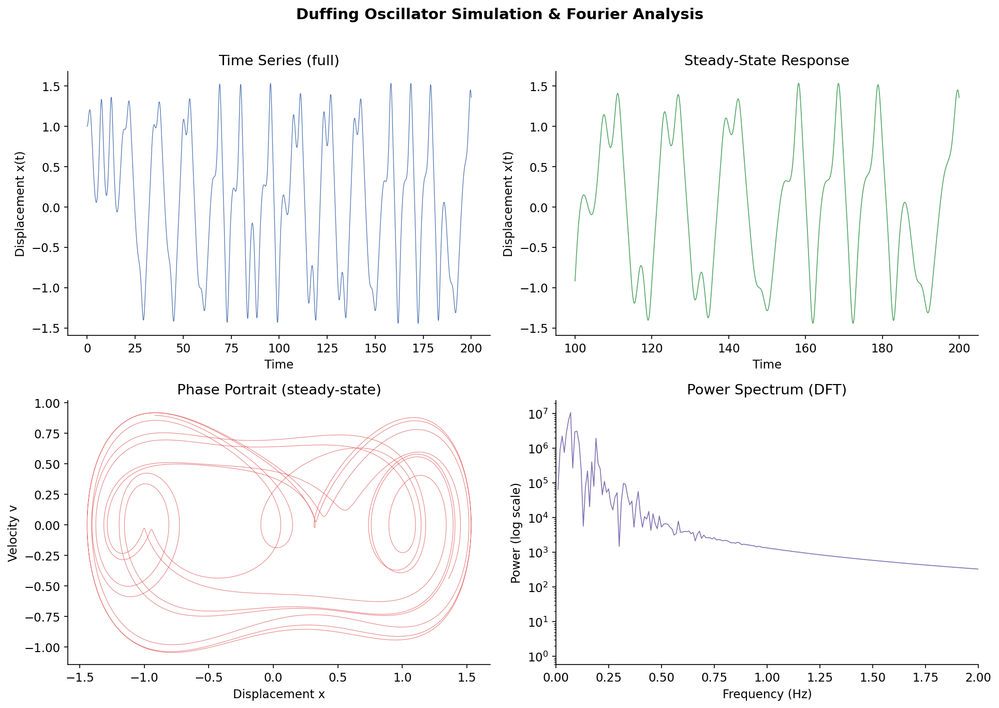

# 🌀 Duffing Oscillator Simulation & Fourier Analysis

A numerical simulation of the Duffing oscillator using the 4th-order Runge-Kutta (RK4) method, with Discrete Fourier Transform (DFT) applied to analyze the frequency components of the oscillator's displacement.

---

## 📌 Project Overview

The Duffing oscillator is a nonlinear second-order differential equation used to model complex dynamical systems that exhibit chaotic behavior. Unlike simple harmonic oscillators, the Duffing equation includes a nonlinear stiffness term that can produce rich and unpredictable dynamics depending on the system parameters.

The equation is:

$$\ddot{x} + \delta\dot{x} + \alpha x + \beta x^3 = \gamma \cos(\omega t)$$

Where:
- $\delta$ — damping coefficient
- $\alpha$ — linear stiffness
- $\beta$ — nonlinear stiffness
- $\gamma$ — forcing amplitude
- $\omega$ — forcing frequency

---

## 📁 Repository Structure

```
duffing-oscillator/
│
├── duffing_oscillator.py       # Main simulation script
├── duffing_analysis.png        # Output plot (4 panels)
├── requirements.txt            # Python dependencies
└── README.md
```

---

## 🔧 Setup & Installation

### 1. Clone the repository
```bash
git clone https://github.com/Om-M67/duffing-oscillator.git
cd duffing-oscillator
```

### 2. Install dependencies
```bash
pip install -r requirements.txt
```

### 3. Run the simulation
```bash
python duffing_oscillator.py
```

The script will generate `duffing_analysis.png` and print key results to the console.

---

## 📊 Parameters Used

| Parameter | Value | Description |
|---|---|---|
| $\delta$ | 0.3 | Damping coefficient |
| $\alpha$ | -1.0 | Linear stiffness (double-well) |
| $\beta$ | 1.0 | Nonlinear stiffness |
| $\gamma$ | 0.5 | Forcing amplitude |
| $\omega$ | 1.2 | Forcing frequency |
| $dt$ | 0.01 | Time step |
| $T$ | 200.0 | Total simulation time |

---

## 📈 Output

The simulation produces a 4-panel figure:

- **Time Series** — full displacement x(t) over 200 time units
- **Steady-State Response** — displacement after transients die out (second half of simulation)
- **Phase Portrait** — velocity vs displacement revealing the strange attractor structure
- **Power Spectrum** — DFT of steady-state signal showing dominant frequency components on a log scale



---

## 🛠 Methods

1. **RK4 Integration** — the Duffing equation is split into a system of two first-order ODEs and integrated using the classical 4th-order Runge-Kutta method for accuracy and stability
2. **Transient Removal** — the first half of the simulation is discarded to eliminate transient behavior before applying the DFT
3. **Fourier Analysis** — NumPy's FFT is used to compute the power spectrum and identify dominant frequency components in the steady-state response

---

## 🧰 Tech Stack

| Tool | Purpose |
|---|---|
| Python 3.x | Core language |
| NumPy | Numerical integration, FFT |
| Matplotlib | Visualization |

---

## 📄 License

This project is open source and available under the [MIT License](LICENSE).

---

## 🙋 Author

Built as part of a computational physics project exploring nonlinear dynamics and chaotic systems. Feel free to fork, star ⭐, or open an issue!
